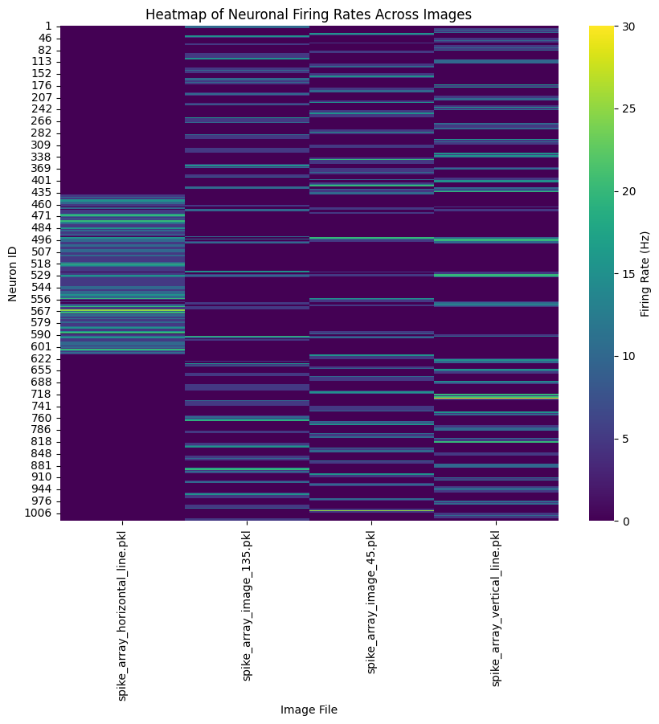

# SCNN model mimicking orientation-selective cells V1
With this project we aim to contribute to the understanding of the neurocomputational basis of orientation-selective cells in the primary visual cortex (V1).

## Dataset Creation

### Convert Images to Poissonian Spikes

Convert your image data to a Poisson spike source to be able to use with Spiking Neural Networks.
### Technique


Poisson Spike Train Generation


  *Rate Coding*


    Count Rate: This is the closest category where Poisson Spike Train Generation can be placed. The method involves counting spikes generated over a time window, where the count rate is influenced by the pixel intensity.

<div align="center">
  <table>
    <tr>
      <td>  </td>
      <td> &rarr; </td>
      <td>  </td>
      <td>  </td>
      <td> &rarr; </td>
      <td>  </td>
      <td> &rarr; </td>
      <td>  </td> 
    </tr>
  </table>
</div>  

<i>
  The parameters below are used when running <a href="convert_image_to_spike_array.py">convert_image_to_spike_array.py</a> in order to turn <a href="https://unsplash.com/photos/KnZDAYgRsz8">pumpkins</a> above into a spike array. 
  <br> max_freq = 60000 (Hz)
  <br> on_duration = 10000 (ms)
  <br> off_duration = 5000 (ms)
</i>


## Model Implementation 
The feedforward multilayer spiking convolutional neural network (SCNN) model has an input layer realizing the contrast cell response. The two hidden layers realize the simple cell response and the complex cell response. The output layer consists of a single output neuron. The complex cell response is subject to the Bienenstock-Cooper-Munro (BCM) learning rule. The Leaky Integrate-and-Fire (LIF) Neurons are part of all layers.
The machine learning algorithm is unsupervised.

## Results & Analysis 
Conducting a Two-Way ANOVA (type III) per simple cell kernel on the two factors "orientation" (levels: 0,45,90,135) and "position" (levels: 0,1,2,3). Vizualising the boxplots accordingly. Second visualization expands the boxplot by information about the evolution of the ouput during training. Make sure you downloaded the file `ouput_data` first. To access the obtained plots see `NeuroNetV1/output_data
/output_data.txt`.

## Running the code 
To specify the model architecture update `model.py`. This is necessary when specifying the simple cell kernel in the function `simple_cell_kernel(gamma = 1)`.
To make sure each of the four model architectures make use of the same generated data that is used for multiple iterations of your network model run `generate_data()` in `train_model.py` only once after four epochs.


## Requirements
* matplotlib (3.0.3)
* numpy (1.17.3)
* opencv-python (4.1.1.26)

Run `pip install -r requirements.txt` to install them all.

## Project Files and Their Usage
```
images-to-spikes/
dataset
  ├── convert_image_to_spike_array.py
  ├── create_dataset.py
  └── dataset_vizualization.ipynb
  ├── draw_image.py
  ├── filtered_images
  ├── images
  │   ├── cross.png
  │   ├── horizontal_line_.png
  │   ├── vertical_lines.png
  │   └── image_45.png
  │   └── image_135.png
  ├── poisson_tools.py
  └── util_functions.py


```
**[convert_image_to_spike_array.py](convert_image_to_spike_array.py)** is the main file. 
  - Please see its usage by running it: `python convert_image_to_spike_array.py images 1000 200 100`
  - The program will store the output spike array as a _pickle_ under _pickles/_ folder in the same directory after the run. 
  - The program will create a folder called plots, tha twill store 4 rester plots with spike trains for each image. 
  - If you do not want a _pickle_ at the end, change the parameter inside the file, i.e. `save_as_pickle=False`.
  - You may use a single image file (extension could be anything _OpenCV_ accepts) or a folder which contains multiple images (extensions need to be _.png_) as input.

**[create_dataset.py](create_dataset.py)** creates a dataset form the saved pickle files and then save it in a csv file called        [spike_dataset.csv](spike_dataset.csv) 

**[dataset_vizualization.ipynb](dataset_vizualization.ipynb)** is a jupyter notebook that helps understand the created dataset where also creates a heatmap of the spike activity in the dataset: 
<div align="center">
  <table>
    <tr>
      <td>  </td>
    </tr>
  </table>
</div> 

**[draw_image.py](draw_image.py)** enables you to draw your own images by adding simple shapes into it via _OpenCV_. For more information please see the file.

**[images](images/)** folder contains three of the images that I generated by using _draw_image.py_, and one example from MNIST dataset (t10k-images-idx3-ubyte__idx_000__lbl_7_.png).

**[poisson_tools.py](poisson_tools.py)** is where the Poisson distribution modelling takes place.

**[util_functions.py](util_functions.py)** includes utility functions of files and images.

## References and Citation
I only used the Poissonian spikes approach to obtain spike arrays from images in this project. The original project also contains _Focal Rank Code Order_ approach in this sense.

Please refer to the original project's [Wiki page](https://github.com/NEvision/NE15/wiki) for further information.
